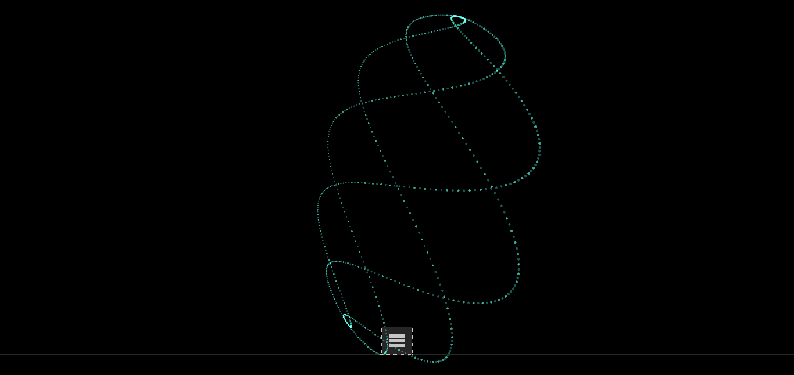
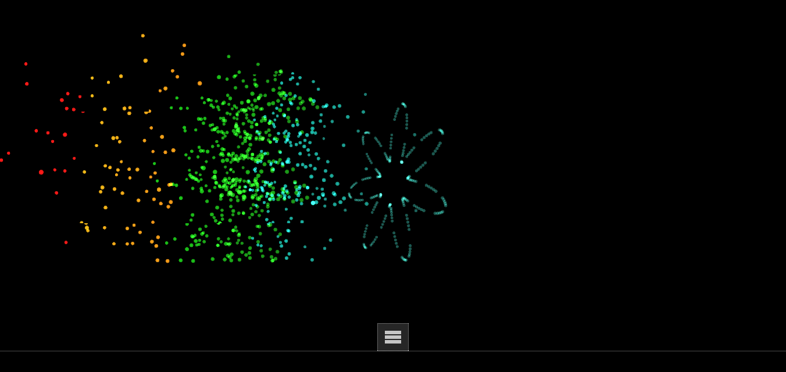

# ThreeJS 3D audio visualizer
## made by winckell benjamin during school project
Project based on this [boilerplate for three.js](http://jeromeetienne.github.io/threejsboilerplate/index.html) or look at [its source](https://github.com/jeromeetienne/threejsboilerplate/blob/master/index.html).

# [DEMO](http://bwinckell.com/projets/threejsaudio/)

## A Screenshot

##Aknowledgement
thanks to [jérome Etienne](jeromeetienne.github.io) for his advises during our sessions on threeJS
## License
Released under [MIT license](https://github.com/jeromeetienne/threejsboilerplate/blob/master/LICENSE)